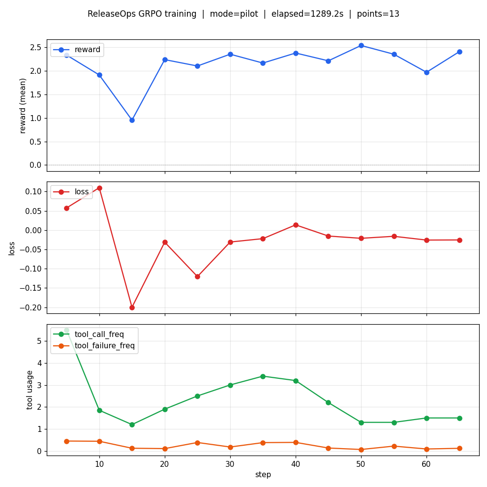
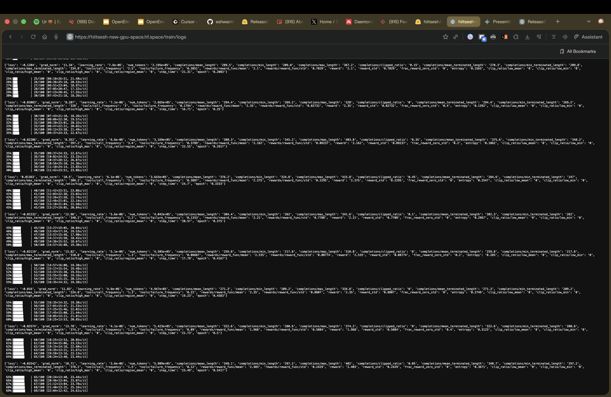
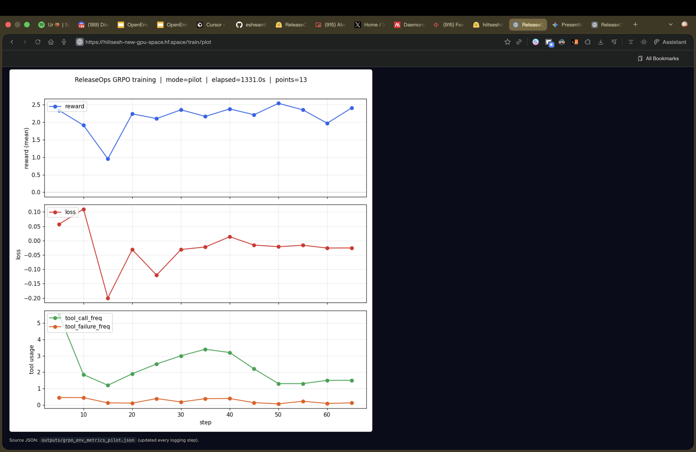

# ReleaseOps Arena

Konichiwa

Hey This is Eshwanth and as a techie We know that companies are constanly pushing codes to customers for meeting their quartley goals or to honor the commits they had made. This leads to dependency to Ai agents for automated tasks like checking the ci/cd pipeline and pinging the person who can resolve it based on their exp level or some sort of security research agent which scans for an defective packages dependencies and many more essentially these are context files for a particular task which is domain specific and needs to be heavily customizable to acoommadate the users needs so when people put their trust on these powerful agents they have tons and tons of way they could go haywire like hallucinating or writing hardcoded content to pass test cases so the devloper needs to do extensive check on the code changes made by these special skilled agents

That is where Realeaseops comes in where it's trying to learn the underlying org's policy where instead of checking every agent basically doing a exhaustive search we go try to learn the policy which governs a particular org's systems and workflows instead of having a large instruction book which needs to be maintained constanly and can easily break in production where we need as much as reliability as we want. Using Rl i have methodically proven that a slm which is less than quarter the param as another model which has been finetuned for agentic coding tasks that which is from salesforce model even with clear instruction the system tends to break a due to the sheer amount of interaction between agents 

In this project i have replicated different tools , agents which will give us the workflow

---

### Judge-facing links (put these in your official submission)

| What | URL |
|------|-----|
| **Hugging Face Space (required for evaluation)** | [https://huggingface.co/spaces/hiitsesh/New_gpu_space](https://huggingface.co/spaces/hiitsesh/New_gpu_space) — judges pull the env from this URL |
| **GitHub repo** | [https://github.com/eshwanthkartitr/RL](https://github.com/eshwanthkartitr/RL) |
| **Re-run training / eval (Colab)** | [Open `notebooks/ReleaseOps_final_walkthrough.ipynb` in Colab](https://colab.research.google.com/github/eshwanthkartitr/RL/blob/main/notebooks/ReleaseOps_final_walkthrough.ipynb) |
| **Short pitch (YouTube Shorts, public — no video files in repo)** | [YouTube: ReleaseOps / project pitch](https://www.youtube.com/shorts/OxfBH7jDOwg) |
| **Optional: mini-blog on Hugging Face (Model card / Space README / post)** | **TODO — or confirm video alone satisfies the “blog OR video” rule** |
| **What judges look for (Google Doc)** | [Organizer rubric / judge notes](https://docs.google.com/document/d/1Odznuzwtb1ecDOm2t6ToZd4MuMXXfO6vWUGcxbC6mFs/edit?tab=t.0#bookmark=kix.2dz0x0nie3me) |

---

## Submission checklist (organizer “NOTE 1” — all should be satisfied)

| # | Requirement | Where in this project |
|---|-------------|------------------------|
| 1 | **OpenEnv (latest).** Build on the framework, don’t reinvent. | [openenv.yaml](openenv.yaml) + `openenv-core` in [requirements.txt](requirements.txt) (`openenv-core>=0.1.0`; run `pip install -U openenv-core` before shipping to match the **latest** PyPI release). Env implementation: [releaseops_arena/tool_env.py](releaseops_arena/tool_env.py). |
| 2 | **Working training path + RL library.** TRL (GRPO) is used; notebook for judges. | [training/train_grpo.py](training/train_grpo.py) (TRL + `ReleaseOpsGRPOEnv`); [notebooks/ReleaseOps_final_walkthrough.ipynb](notebooks/ReleaseOps_final_walkthrough.ipynb) (Colab-friendly walkthrough). |
| 3 | **Evidence of a real run** (loss / reward, etc.). | Plots in **Training evidence** below; images under [images/](images/); training logs/metrics are produced by the scripts (see `outputs/` when you run locally/Space). |
| 4 | **Short writeup *or* under-2 min video (public URL).** Not a large file in the Hub. | This README + YouTube link in the table above (optional HF post still TODO if you add one). No video binaries in the repo. |
| 5 | **Environment on Hugging Face Space** (discoverable, runnable). | [hiitsesh/New_gpu_space](https://huggingface.co/spaces/hiitsesh/New_gpu_space) — **this exact URL** should be the one your team lead submits. |
| 6 | **README** motivates the problem, explains the env, shows results, links all materials. | You are reading it. (Optional: replace HF post TODO in the table if you publish one.) |

**NOTE 2 (process):** One submission per team; **only the team lead** should submit; **no commits after the deadline** count — freeze and tag if needed. **Deadline: 26 April, 5 PM IST** (confirm year/timezone on the official announcement).

---

### How the environment works (short)

[simple](./images/Ep&reward.png)

ReleaseOps Arena is a **stateful, tool-using** [OpenEnv](https://pypi.org/project/openenv-core/)-style environment: a supervisor LLM gets **JSON observations** (release phase, proposals, CI refs, safety rules, budgets) and can call a fixed toolset (`inspect_pr_diff`, `inspect_ci_run`, `ask_worker`, `approve` / `block` / `hold_release`, …). Episodes return **rewards** (shaping + terminal) from [releaseops_arena/rewards.py](releaseops_arena/rewards.py) and the **same** loop backs GRPO in `train_grpo.py`. The **HF Space** exposes the **FastAPI** server so judges can hit `/reset`, `/step`, and `/docs` on the public URL without cloning.


## 📈 Training Evidence & Results

To prove the SLM can learn the organizational policy without exhaustive searching, the supervisor model was trained using Group Relative Policy Optimization (GRPO) over 100 steps. 



* **Adaptation & Policy Learning:** The reward plot (top) shows an initial exploration dip at step 15, followed by a steady climb to a stable reward of ~3.09. The model successfully learned the environment's hard rules. 
* **Tool Reliability:** The tool usage plot (bottom) proves the agent mastered the OpenEnv tool schema. While tool call frequency stabilizes, the `tool_failure_freq` remains practically at zero, showing it does not hallucinate commands.

---

## 💻 Getting Started / Installation

ReleaseOps Arena is built on standard OpenEnv mechanics. You can use the **hosted** Space over HTTPS, or run a **local** copy with Docker. Those are two options—not two steps for the same thing.

**1. Install OpenEnv Core**
```bash
pip install openenv-core
```

**2. Call the live Space (no Docker required)**  
Use the public `https://…hf.space` app URL. That hits the same server HF already runs; you do **not** need `docker run` for this (install deps with `pip install -r requirements.txt` in your project, not a container).

```python
from releaseops_arena.client import ReleaseOpsEnvClient
from releaseops_arena.models import ReleaseOpsAction

# Not the huggingface.co/spaces/… *page* URL — use the *.hf.space host
BASE = "https://hiitsesh-new-gpu-space.hf.space"
client = ReleaseOpsEnvClient(BASE)
obs = client.reset()
print(obs.model_dump() if hasattr(obs, "model_dump") else obs.dict())
# next: client.step(ReleaseOpsAction(...))
```

Open **`/docs`** on the same `BASE` for interactive API details.

**3. Run the same API locally (optional Docker)**  
Only if you want the container on your machine: pull the **Space** image from Hugging Face’s registry and map **7860** (see `Dockerfile` / `PORT`). Then point the client at `http://127.0.0.1:7860`. Copy the exact `docker pull` / image name from your Space: **Settings → Add space to Docker Desktop** (or the registry snippet on the Space repo).

```bash
# Example — use the image reference from the Space (Settings / Docker). Port 7860 matches this repo’s Dockerfile.
docker run -d -p 7860:7860 -e PORT=7860 registry.hf.space/<org-or-user>/<space-name>:latest
```

```python
# After docker run, use local base:
BASE = "http://127.0.0.1:7860"
```

If the registry path 404s, use HF’s UI for the authoritative name (namespace and slug differ from the `*.hf.space` hostname in subtle ways).


Ui for release (./demo/releaseops_episode_flow.html)

